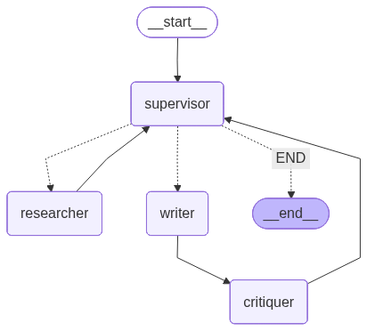

# Multi-Agent Research Assistant

A collaborative **Agent-to-Agent (A2A)** system built using **LangChain** and **LangGraph**, designed to generate detailed and well-structured research reports through intelligent agent cooperation.  

  
*System architecture built with LangGraph illustrating multi-agent collaboration.*

##  Project Structure

```
multi_agent_researcher/
├── assets/
│   └── (graph visualizations saved here)
├── .env
├── requirements.txt
├── prompts.py
├── agents.py
├── graph.py
├── visualize_graph.py
├── app.py
└── README.md
```

##  Installation

### Prerequisites

- Python 3.9 or higher
- pip package manager
- (Optional) Graphviz for graph visualization

### Step 1: Clone or Create Project Directory

```bash
mkdir multi_agent_researcher
cd multi_agent_researcher
```

### Step 2: Install Python Dependencies

```bash
pip install -r requirements.txt
```

### Step 3: Configure Environment Variables

Create a `.env` file in the root directory:

```bash
# Get API key from https://console.groq.com/
GROQ_API_KEY=your_groq_api_key_here

# Get API key from https://tavily.com/
TAVILY_API_KEY=your_tavily_api_key_here
```

**Getting API Keys:**

1. **Groq API**: Sign up at [Groq Console](https://console.groq.com/) and create an API key
2. **Tavily**: Sign up at [tavily.com](https://tavily.com/) and get your API key

### Step 4: (Optional) Install Graphviz for Visualization

**Ubuntu/Debian:**
```bash
sudo apt-get install graphviz graphviz-dev
```

**macOS:**
```bash
brew install graphviz
```

**Windows:**
```bash
choco install graphviz

```

## 🎯 Usage

### Generate Workflow Visualization (Optional)

```bash
python visualize_graph.py
```

This creates a visual diagram of the agent workflow in `assets/research_graph.png`

### Run the Streamlit Application

```bash
streamlit run app.py
```

The app will open in your browser at `http://localhost:8501`

## 🤖 How It Works

The system uses four specialized AI agents that work together:

1. ** Supervisor Agent**
   - Coordinates the entire workflow
   - Decides which agent should work next
   - Manages task delegation

2. ** Researcher Agent**
   - Searches the web for relevant information
   - Uses Tavily search API
   - Gathers and compiles research findings

3. ** Writer Agent**
   - Creates research reports from findings
   - Revises drafts based on feedback
   - Ensures coherent and well-structured output

4. ** Critiquer Agent**
   - Reviews drafts for quality
   - Provides actionable feedback
   - Approves final reports

### Workflow

```
Start → Supervisor → Researcher → Supervisor → Writer → Critiquer → Supervisor
                ↑                                                        ↓
                └────────────────── (loop until approved) ──────────────┘
```

## 🚀 Deployment to Railway

You can deploy this Streamlit app to [Railway](https://railway.app/) using either of the following two options:

### Option 1: Automatic GitHub Integration (Recommended)
1. Go to [Railway.app](https://railway.app/) and create a new project.
2. Select **"Deploy from GitHub repo"** and choose your repository `mars-multi-agent-research-system`.
3. In the Railway service dashboard, navigate to **Settings** → **Build & Deploy**:
   - Nixpacks will automatically detect Python and configure the build.
   - The start command is read automatically from the `Procfile`:
     ```bash
     streamlit run app.py --server.port $PORT --server.address 0.0.0.0
     ```
4. Navigate to **Variables** and add your production environment variables:
   - `GROQ_API_KEY`: Your Groq API Key
   - `TAVILY_API_KEY`: Your Tavily API Key
5. Under **Settings** → **Networking**, click **"Generate Domain"** to get a public URL for your application.
6. The app will build and deploy. Any subsequent pushes to the `main` branch will automatically trigger a new deployment.

### Option 2: CI/CD Deployment via GitHub Actions
If you prefer triggering deployments programmatically from your pipeline:
1. Generate a **Project Token** in your Railway Project Settings.
2. Add the token to your GitHub repository secrets as `RAILWAY_TOKEN` (**Settings → Secrets and variables → Actions → New repository secret**).
3. Every push to the `main` branch will trigger the CD workflow (`.github/workflows/cd.yml`), executing the tests and automatically deploying to Railway via the Railway CLI.

##  Troubleshooting

### Common Issues

**1. Import Errors**
```bash
# Reinstall all dependencies
pip install -r requirements.txt --upgrade
```

**2. API Key Errors**
- Verify your `.env` file is in the project root
- Check that API keys are correct and active
- Ensure no extra spaces in the `.env` file

**3. Groq API Connection Issues**
- The code uses Groq's API via LangChain
- Ensure your API key is valid and has not expired
- Check network connectivity

**4. Graphviz Installation Issues**
- Graphviz is optional for visualization
- The app will work without it
- If needed, follow standard platform installation instructions.
Hello and welcome to MARS created by Anand Raj Singh.